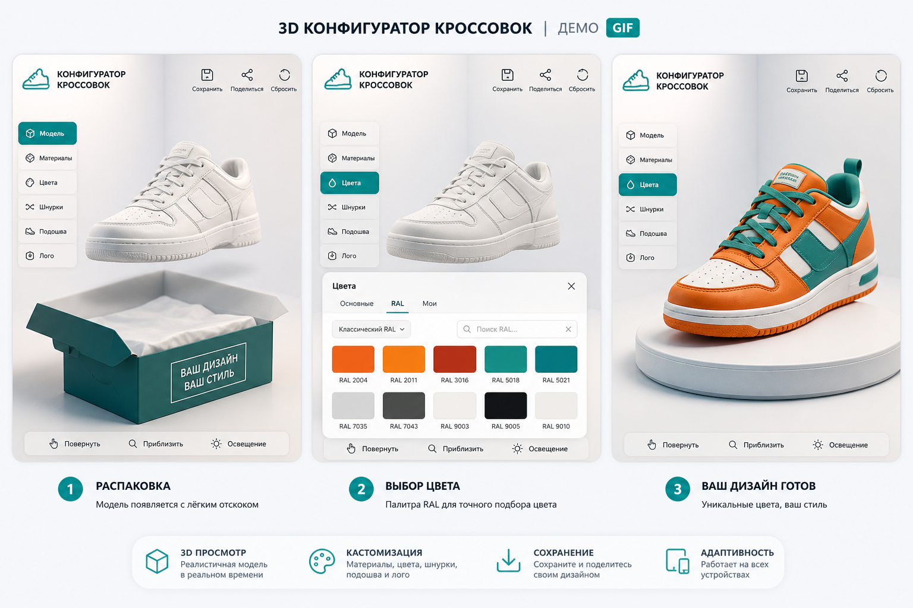
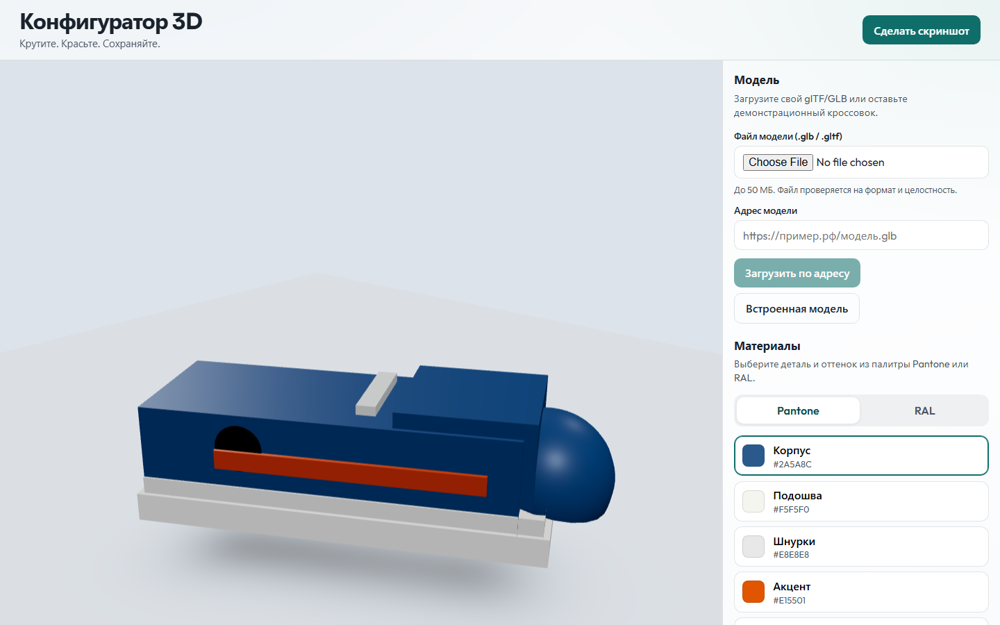
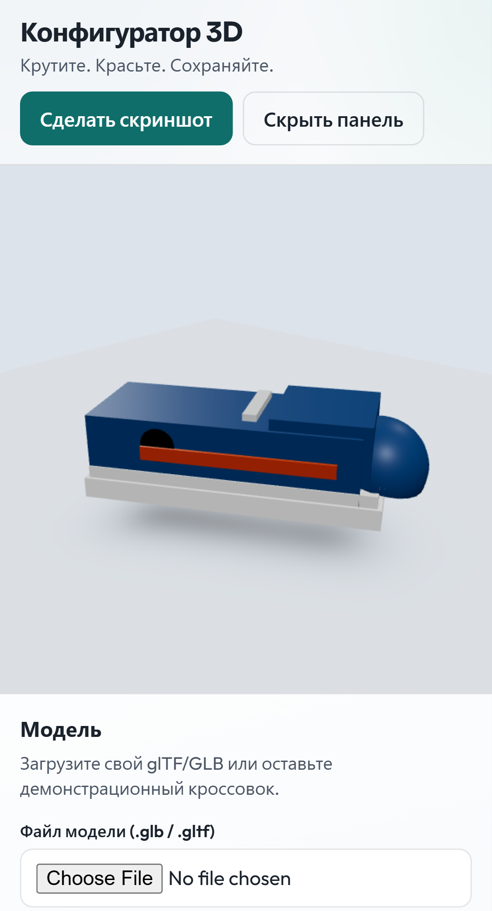
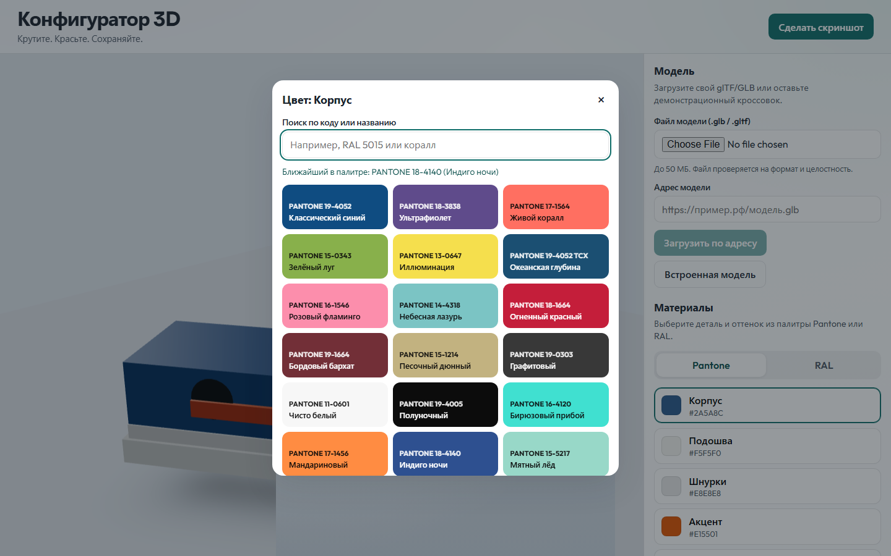

# Интерактивный 3D-конфигуратор товаров

Витрина товара, которую можно вращать, масштабировать и настраивать в реальном времени. Цвета материалов привязаны к палитрам **Pantone** и **RAL**. Подходит как портфолио-демо и как основа для заказов от интернет-магазинов.









## Возможности

- Загрузка собственной модели **glTF / GLB** (файл или адрес) с проверкой формата, размера и целостности
- Встроенный процедурный кроссовок — работает сразу после клонирования, без внешних ассетов
- **OrbitControls**: вращение, зум, перемещение
- Панель материалов (`MeshStandardMaterial`) с палитрой-пипеткой (не скучный `input type="color"`)
- Цвета из палитр Pantone и RAL
- **Галерея пресетов** — готовые цветовые схемы в один клик
- Модальное окно **«Технические характеристики»**
- Кнопка **«Сделать скриншот»** в разрешении 1920×1080 (OffscreenCanvas + Web Worker)
- Анимация «распаковки» модели с лёгким подпрыгиванием
- Сохранение конфигурации в LocalStorage, IndexedDB и URL hash
- Весь интерфейс на русском, без бэкенда и без `.env`

## Стек

React 19 · TypeScript · Vite · Three.js / React Three Fiber / Drei · Zustand · idb · Vitest · Playwright

## Быстрый старт

```bash
npm install
npm run dev
```

Откройте адрес Vite (обычно `http://localhost:5173`).

```bash
npm run build
npm run preview
```

## Тесты

```bash
npm test
npx playwright install chromium
npm run test:e2e
npm run test:all
```

## Lighthouse

```bash
npm run lighthouse
```

Цели: Performance > 90, Accessibility > 95, Best Practices > 95.

## Структура

```
src/
  components/   # сцена, панель, палитра, UI
  data/         # pantone.json, ral.json
  lib/          # валидация, цвета, storage, скриншоты
  store/        # состояние
  workers/      # Web Workers
e2e/            # Playwright
docs/           # скриншоты и демо
```

## Управление

| Действие | Жест |
| --- | --- |
| Вращение | ЛКМ / один палец |
| Перемещение | ПКМ / два пальца |
| Масштаб | Колесо / щипок |

## Лицензия

MIT
